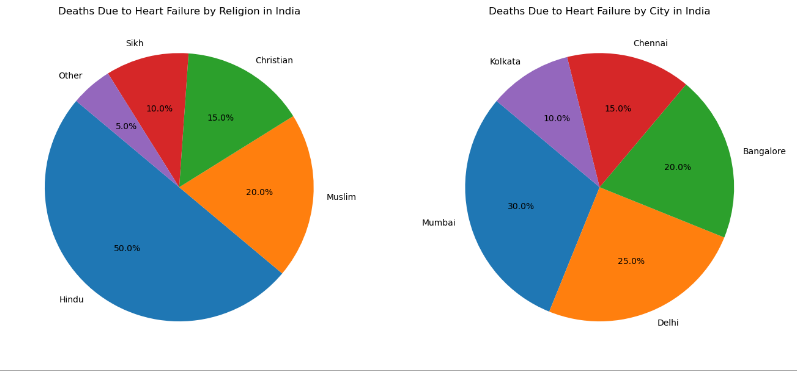

# Project8-EDA-Heart-Failures-By-Religion-and-Cities
> **Brief Description:** - Incidents of heart failures observed among various religions in India along with incidents happening in different cities.

---

## Table of Contents

- [Description](#description)
- [Video Explanation](#video)
- [Technologies Used](#technologies-used)
- [Dataset](#dataset)
- [Program Codes ](#program-codes)
- [Screenshots](#screenshots)
- [Contribution](#contributipn)
- [Contact Details](#contact-details)

---

## Description

Cases of heart failure cases in Kolkata compared for Smokers and Alcoholics during different months of the year. The plotting in this case has been done as comparable line chart with different colors.

## Video
<!--
 
-->

We are working on this section. Please check at some other time.

## Technologies-used

Python programming language, pandas, folium, IPython and geopandas package.

## Dataset

The dataset has been generated by another program. However, it is recommended that for real life analysis actual data should be collected and processed properly to get realistic results.

## Program-codes

The programs are written on jupiter notebook, You may run the program on Google colab by clicking on the colab badge below. However, the output may not be generated on colab. For that you have to download the program and run it locally. Make sure that the packages are all installed.

## Screenshots

**This program generates two pie charts side by side to visualize the distribution of heart failure deaths in India by religion and by city. Here's what can be learned from the output:**

- **Deaths by Religion:**

  - The first pie chart shows the proportion of heart failure deaths among different religious groups in India. Each slice represents a religious group, and the size of the slice indicates the percentage of total deaths attributed to that group.
  - This helps in understanding which religious groups are more affected by heart failure deaths and whether there are significant differences between groups.

- **Deaths by City:**

  - The second pie chart displays the distribution of heart failure deaths across different cities in India. Each slice represents a city, and the size of the slice indicates the percentage of total deaths in that city.
  - This visualization helps identify which cities have higher or lower proportions of heart failure deaths, providing insights into geographical disparities in heart failure mortality.

- **Proportional Comparison:**

  - Both pie charts use percentages to provide a clear and immediate understanding of the relative proportions. This makes it easy to compare the impact of heart failure deaths across different religions and cities.

- **Targeted Insights:**

  - Public health officials and policymakers can use these insights to tailor interventions and allocate resources more effectively. For example, if a particular religious group or city shows a disproportionately high percentage of heart failure deaths, targeted health campaigns or medical resources can be directed there.

- **Overall Distribution:**

  - The pie charts give an overall picture of how heart failure deaths are distributed among religious groups and cities, highlighting potential areas for further investigation or intervention.

In summary, the output of this program provides a clear and visual representation of the distribution of heart failure deaths by religion and city in India, offering valuable insights for public health planning and intervention.

## Contribution

The programs are written by Santanu Karmakar

## Contact-details

If you wish to contact me, please leave a message (Preferably WhatsApp) on this number: 6291 894 897.
Please also mention why you are contacting me. Include your name and necessary details.
Thank you for taking an interest.
